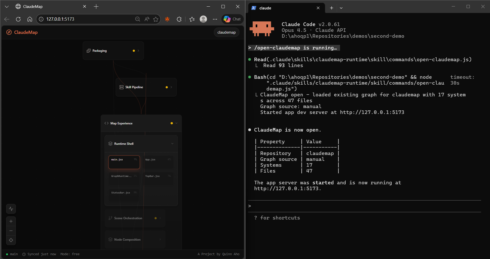

Welcome to...


[](CHANGELOG.md) [](LICENSE)  

**Google Maps for vibecoders.**

AI lets you build faster than ever, but the very tools that help our productivity are leaving us behind - you don't understand what you're building anymore. You can vibecode a full app in a weekend and not even start to explain how it works. ClaudeMap fixes that.

Unlike traditional visualization tools, ClaudeMap organizes your code by what it actually does. Claude reads your project and groups it into concepts in a way you actually think about your project. Zoom out to see the big picture. Zoom in to see the details. Colors show what's healthy and what's broken.
Use `/explain` and ask any question about your code, Claude will present directly on the map and explain step by step.
Use `/show` to tell Claude what you want to find or see, and it moves the map for you.

All powered by the same AI you vibecode with.

## See It In Action

Click Me ↓
[](https://www.loom.com/share/6a2ff0948ae64ae6994fb3817cb3607e)

[Play with ClaudeMap's map](https://quinnaho.github.io/claudemap/) (preview, Claude features require Claude Code)

[Longer YouTube walkthrough](https://www.youtube.com/watch?v=mubRRx5mXzA) if you're into that kind of thing.

## Get Started

You'll need [Claude Code](https://docs.anthropic.com/en/docs/claude-code) installed.

```bash
cd <your-repo>
npx @quinnaho/claudemap install
claude
/setup-claudemap
```

Your codebase is now a map.

Already using ClaudeMap? Update the install with:

```bash
npx @quinnaho/claudemap update
```

### Codex users

ClaudeMap also supports [Codex](https://github.com/openai/codex). Pass `--assistant codex` to install the Codex-flavored skill (TOML agent under `.codex/agents/`, skill under `.agents/skills/`, no slash commands):

```bash
cd <your-repo>
npx @quinnaho/claudemap install --assistant codex
```

See [CODEX.md](CODEX.md) for details on the Codex layout, command invocation, and the cross-assistant switch guard.

## Commands

| Command | What it does |
|---------|-------------|
| `/setup-claudemap` | Analyze your repo and generate the map |
| `/refresh` | Update the map after code changes |
| `/open-claudemap` | Reopen the map without rebuilding |
| `/explain` | Visual guided walkthroughs - Claude highlights the path on your map as it explains |
| `/show` | Direct the map with natural language - "show me auth", "what's broken" |

## How It Works

ClaudeMap installs as a Claude Code skill. When you run `/setup-claudemap`, it reads your project, sends the structure to a dedicated architecture subagent, and renders the result as an interactive map in your browser. No cloud, no backend - everything runs locally through Claude Code.

After code changes, `/refresh` detects what changed and updates the map without rebuilding from scratch.

## Project Structure

```
app/        -> Visual map interface
skill/      -> Claude Code skill and architecture subagent
scripts/    -> Install and packaging scripts
contracts/  -> Graph schema and seeded ClaudeMap self-map
```

## Development

```bash
npm install
npm run dev
```

Run the package smoke test:

```bash
npm test
```

That one command builds the local ClaudeMap artifact, installs it into a throwaway fixture repo, runs the installed `setup-claudemap` and `create-map` flows, and verifies the packaged feedback-prompt templates plus the `graph/` runtime layout.

If you specifically need the raw tarball for manual testing in another repo:

```bash
npm run pack:test
npm exec --package="<absolute-path-to-artifacts/npm/quinnaho-claudemap-<version>.tgz>" -- claudemap install
```

> ClaudeMap started as a hackathon project and is now open source. If you want to use it, improve it, or help shape where it goes: jump in.

## License

MIT
