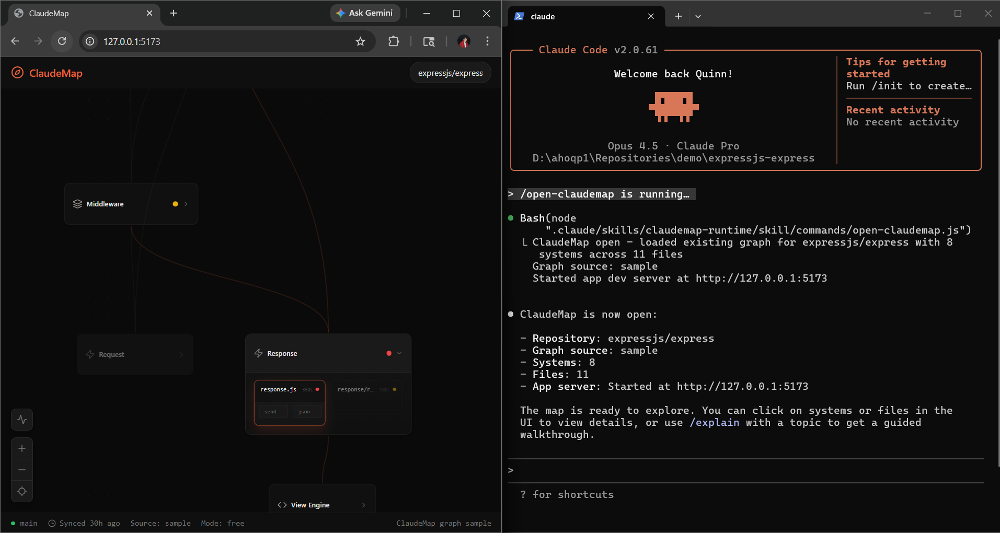

# ClaudeMap



## Video Presentation

https://www.youtube.com/watch?v=mubRRx5mXzA

## Project Information

**Title**  
ClaudeMap

**Summary**  
ClaudeMap is a live architecture mapping and walkthrough tool. It turns project
structure into a visual system/file/function map, then lets the runtime guide
that map through highlights, focus, and presentation steps. This repository also
packages two demos: `FirstDemo`, a curated walkthrough of ClaudeMap itself, and
`SecondDemo`, an Express-shaped sample project.

**Contributors**  
- Quinn Aho

## Navigating The Repo

- `app/` - React app for the interactive map UI
- `skill/` - CLI/runtime commands and shared libraries
- `scripts/` - packaging and artifact generation
- `contracts/` - seeded graph JSON and runtime state contracts
- `demo/` - demo sandbox sources and demo documentation
- `artifacts/` - packaged outputs, including `FirstDemo` and `SecondDemo`

## Where Things Live

- Notebooks: there are no notebooks in this repository
- Data and demo graph payloads: `contracts/` and `demo/`
- App code: `app/src/`
- Skill and runtime code: `skill/`
- Packaging code: `scripts/`

## Key Files

- `contracts/claudemap-first-demo.json` - curated graph for the ClaudeMap demo
- `contracts/claudemap.sample.json` - sample graph for the Express demo
- `scripts/package-claudemap-skill.js` - packages the skill artifact and both demos
- `app/src/components/graph/GraphCanvas.jsx` - main graph scene, focus, and camera behavior
- `app/src/hooks/useGraphData.js` - loads runtime graph/state into the app
- `skill/lib/mcp-client.js` - bridges runtime updates into the live app
- `skill/commands/control.js` - manual control surface for highlight, present, caption, and mode changes

## Run The Project

```bash
npm install
npm run dev
```

Useful extras:

```bash
npm run build
npm run package-skill
```

`npm run package-skill` creates the packaged artifact and the `FirstDemo` /
`SecondDemo` demo bundles in `artifacts/claudemap-skill/claudemap/`.
