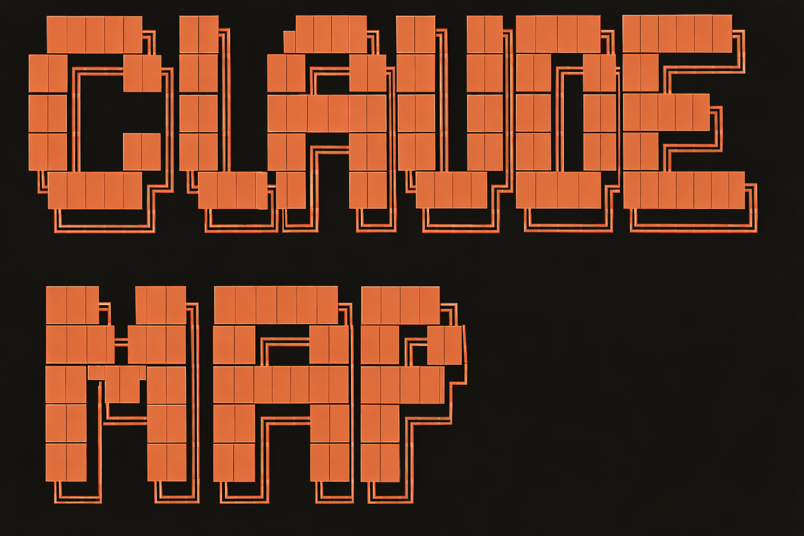
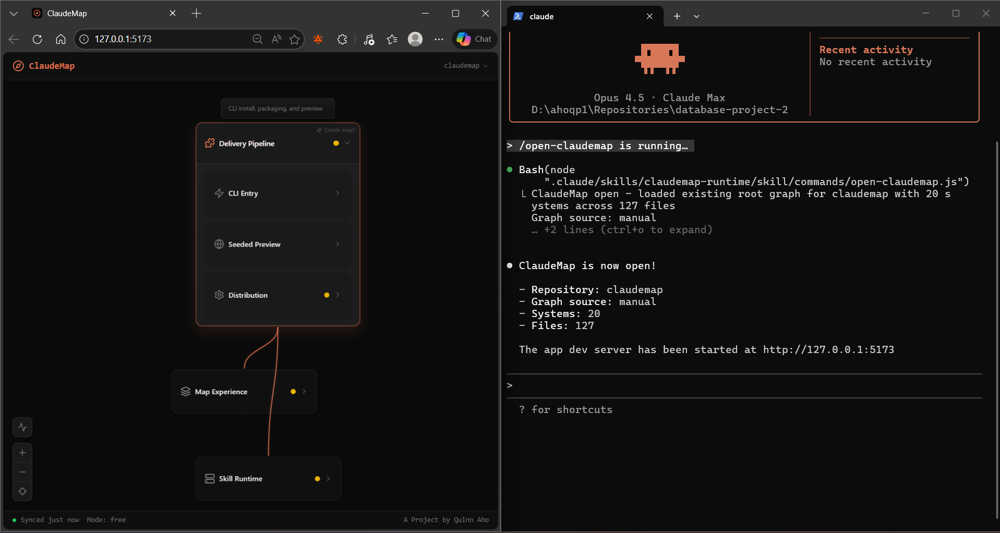

Welcome to...


[](CHANGELOG.md) [](LICENSE)  

**Google Maps for vibecoders.**

AI helps you build fast, but leaves you behind. ClaudeMap reads your project and renders it as an interactive map organized by what your code *does*, not where files live. All with the AI you code with

[](https://www.loom.com/share/6a2ff0948ae64ae6994fb3817cb3607e)

[Try the live demo](https://quinnaho.github.io/claudemap/) (preview only, full features require Claude Code or Codex)

## Install

```bash
npx @quinnaho/claudemap install
claude
/setup-claudemap
```

Codex users: `npx @quinnaho/claudemap install --assistant codex` - see [Codex guide](docs/CODEX.md).

In Codex, run `/skills`, choose `codexmap-runtime`, then prefix natural-language requests with `$codexmap-runtime`, for example:

```text
$codexmap-runtime build the initial architecture map for this repo
```

## Commands

| Command | Description |
|---------|-------------|
| `/setup-claudemap` | Analyze your repo and generate the map |
| `/refresh` | Update map after code changes |
| `/explain` | AI-guided walkthroughs with visual highlighting |
| `/show` | Navigate the map with natural language |

## What's New in v0.2.0

- **Multi-map support** - create scoped maps for large codebases
- **Codex support** - works with Claude Code and OpenAI Codex
- **Stable map generation** - consistent layouts across rebuilds
- **Iterative refinement** - tweak your map without starting over
- **Better refresh UX** - smoother updates after code changes

## Learn More

- [Full Guide](docs/GUIDE.md) - setup walkthrough, commands, multi-map workflow
- [Codex Guide](docs/CODEX.md) - Codex-specific setup and commands
- [Changelog](CHANGELOG.md) - version history
- [Contributing](CONTRIBUTING.md) - help improve ClaudeMap

## License

MIT
