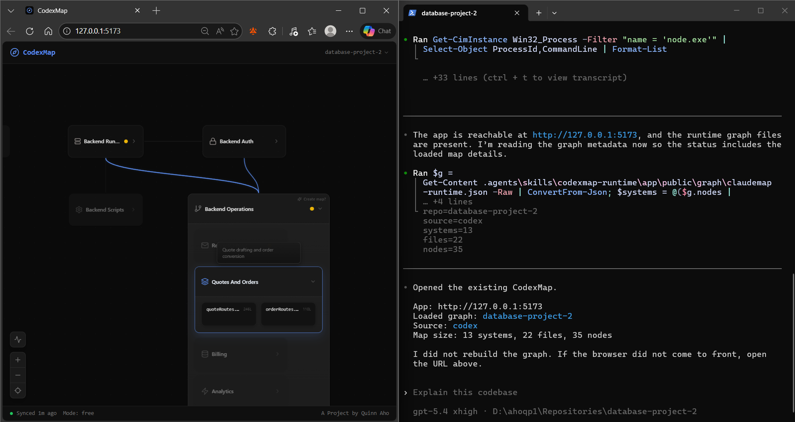

# ClaudeMap for Codex

## Use In Codex

```bash
cd <your-repo>
npx @quinnaho/claudemap install --assistant codex
```

Then open Codex in that repo:

1. Run `/skills`.
2. Choose `codexmap-runtime`.
3. Prefix your request with the inserted skill mention.
4. Ask naturally.

```text
$codexmap-runtime build the initial architecture map for this repo
```

[](https://www.loom.com/share/6a2ff0948ae64ae6994fb3817cb3607e)

## Common Requests

```text
$codexmap-runtime refresh the map after my latest edits
$codexmap-runtime create a focused map for the auth system
$codexmap-runtime show the request-to-order flow
$codexmap-runtime explain how authentication works
$codexmap-runtime reopen the existing map without rebuilding
```

## Important

Codex uses skills for ClaudeMap operations. Do not use Claude Code slash commands like `/setup-claudemap` in Codex.

Use `/skills` and select `codexmap-runtime`, or type `$codexmap-runtime` directly when Codex recognizes the skill mention.

## Update

```bash
npx @quinnaho/claudemap update --assistant codex
```

## Switching Assistants

If the repo already has a Claude install and you want the Codex version, run:

```bash
npx @quinnaho/claudemap install --assistant codex --force-assistant-switch
```
